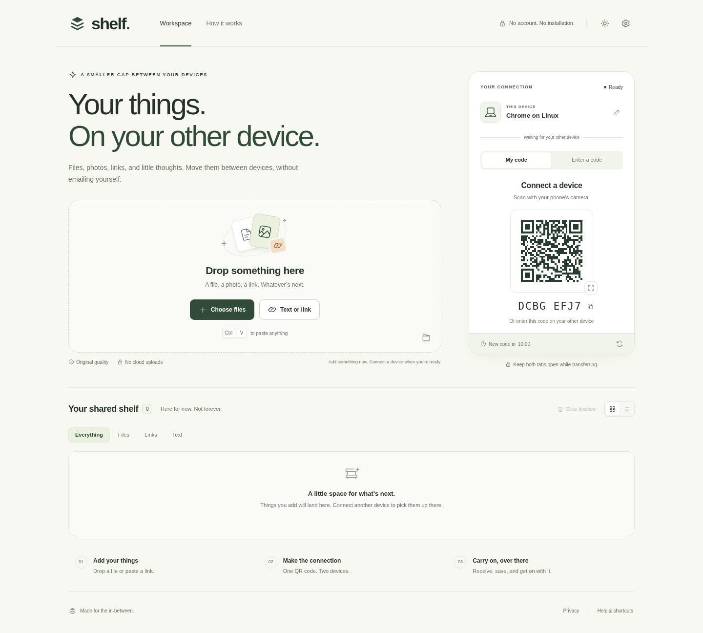

# Shelf
### Your things. On your other device.

A temporary, accountless shared shelf between **two browsers**. Add files, photos, text, or links before pairing; connect using a QR invitation or eight-character code; explicitly approve and receive content on the other device.



## Run the packaged app

Requires **Node.js 22.16 or newer**. This ZIP includes the compiled browser app and has **zero runtime npm dependencies**.

```sh
cd shelf
npm start
```

Open `http://localhost:3000` in two separate tabs or browser contexts. No `npm install` is needed to run the included build. Do not open `dist/index.html` directly: the signaling service is required.

For actual phone-to-computer use, serve the same app to both devices over **HTTPS**. A phone's `localhost` points to the phone, not your computer. See [Deployment](docs/DEPLOYMENT.md).

## Included

| Area | Implementation |
| --- | --- |
| Pairing | Real QR deep links, readable 8-character codes, expiring invitations, explicit connection approval, cancellation and rejection |
| Sharing | Files and photos, file selection/drop/paste, text and HTTP(S) links, content queued before connection, bidirectional transfers |
| Receiving | Per-item approval, decline, cancel, verified delivery, copy/open/download, supported native sharing and safe image previews |
| Recovery | Bounded transfer queue, backpressure, reconnect attempts, resume from acknowledged bytes while both tabs remain alive, retry |
| Interface | Responsive desktop/mobile workspace, sticky mobile actions, actual transfer cards, grid/list/filter views, clear completed items |
| Appearance | Light/dark/system theme, English and Arabic/RTL core interface, reduced-motion handling, keyboard shortcuts, semantic dialogs |
| Privacy | No accounts, analytics, advertising, tracking scripts, remote link previews or content upload to the signaling server |
| Safety | HTTPS production origin checks, random session credentials, rate limits, approval gates, bounded messages, SHA-256 integrity checks |
| Storage | Temporary browser-disk receiving when available; bounded 128 MiB memory fallback; explicit end-session cleanup |
| Operations | Standalone Node service, health check, Dockerfile, HTTPS Compose/Caddy configuration, TURN template, CI workflow, tests |

The ready-to-run product is functional, not a visual mockup. It is **not a completed independent security audit or a guarantee of compatibility with every browser/network**. Details: [Test report](docs/TEST_REPORT.md), [Known limitations](docs/KNOWN_LIMITATIONS.md).

## The flow

1. Open Shelf on both devices. Add content now or after connecting.
2. Scan the first device's QR using the phone's regular camera, or enter its short code on the second device.
3. Approve the named device. Device names are user-chosen labels, not verified identities.
4. Accept each incoming item. Delivery becomes complete only after integrity verification.
5. Save files or copy/open text and links. End the session to clear the temporary shelf on both devices.

Keep both tabs open and active during a transfer. Refreshing or closing a tab loses its live shelf. Session duration defaults to 30 minutes; invitation duration to 10 minutes. Sessions may be extended within a two-hour maximum.

## Why this implementation is small

The UI uses strict TypeScript, semantic HTML, CSS design tokens, and native browser APIs. The backend uses Node's HTTP and crypto modules. Pairing and WebRTC signaling use authenticated streaming HTTP/SSE; the payload uses a native WebRTC data channel. A WebSocket library and front-end framework are unnecessary for this bounded, single-workspace application.

The browser's WebRTC stack provides DTLS encryption. The incremental SHA-256 implementation verifies delivered bytes; it is not a custom encryption system. QR code encoding is covered by independent golden vectors and rendered-code decoding checks.

## Development

```sh
npm ci
npm run check       # strict TypeScript check, production build, Node tests
npm start           # serve the resulting dist/ directory
```

After editing client files, run `npm run build` and refresh the browser. `npm run watch:client` watches TypeScript only; CSS/HTML assets still require a build. `npm run dev` builds once, then watches the Node server. There is no misleading claim of full hot-module replacement.

For the real-browser suite:

```sh
python -m pip install -r e2e/requirements.txt
python -m playwright install chromium
npm run test:e2e
```

The suite starts an isolated localhost server automatically. It uses two browser contexts, real peer connections and real downloads. To use an existing server set `SHELF_E2E_BASE_URL`; to select an installed Chromium executable set `CHROMIUM_PATH`. Browser binaries and Python packages are not bundled.

## Project map

```text
src/main.ts              Application UI and lifecycle
src/components/          Own SVG icon components
src/lib/peer.ts          WebRTC negotiation, recovery, route and safety mark
src/lib/signaling.ts     Authenticated event stream and API calls
src/lib/transfer.ts      Offers, acceptance, queue, chunking, ACKs and verification
src/lib/storage.ts       Browser-disk temporary files and memory fallback
src/lib/protocol.ts      Validated controls and binary frame format
src/lib/sha256.ts        Incremental SHA-256
src/lib/qr.ts            Local QR encoding; no external QR service
src/lib/i18n.ts          English/Arabic copy
public/                 HTML, CSS, manifest, vector app icon
server/index.mjs         Ephemeral pairing/signaling service and static host
dist/                   Ready-to-run compiled browser application
tests/                  Unit, protocol, transfer and server/security tests
e2e/                    Real two-browser end-to-end tests
deploy/                 HTTPS and TURN configuration examples
docs/                   Design, architecture, operations, limitations, test report
```

## Configuration

Copy `.env.example` to `.env` to customize the local service. `npm start` reads `.env`; Docker Compose maps the required values explicitly. Never publish a real `.env` or TURN shared secret.

The public HTTPS deployment is in [docs/DEPLOYMENT.md](docs/DEPLOYMENT.md). Do not deploy this as static files alone or on a short-lived serverless function: the signaling process holds live sessions and event streams.

## Additional documentation

- [Architecture and protocol](docs/ARCHITECTURE.md)
- [Design and UX specification](docs/DESIGN.md)
- [Deployment and launch checklist](docs/DEPLOYMENT.md)
- [Security model](SECURITY.md)
- [Known limitations](docs/KNOWN_LIMITATIONS.md)
- [Executed test report](docs/TEST_REPORT.md)

MIT license for the original code. No font files or third-party images are bundled. TypeScript is a build-time dependency installed separately under its own license.
